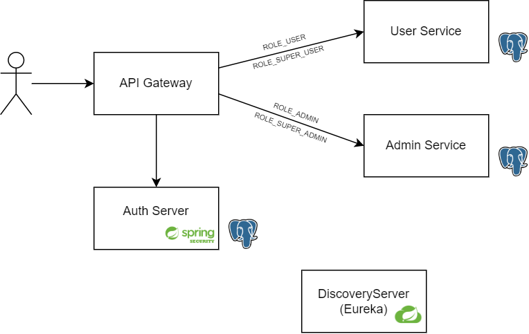

# Greeting-Microservices

## Microservices
#### Discovery Server
Simple Eureka discovery server
#### API Gateway
Simple Spring gateway. Authenticates requests using Auth service.
Validates incoming request (token,role) using /token/validate endpoint on AuthService. 
#### Auth Service
Contains user and roles information on PostgreSQL db. User and Role entities has One to Many relationship.
This service authenticates user and produces access and refresh token using SpringSecurity.
Service also has /token/validate endpoint that validates incoming requests. This endpoint could be improved in the future.
#### Admin Service
Only ROLE_ADMIN and ROLE_SUPER_ADMIN roles can access this service.
It has PostgreSQL database and has simple CRUD operations.
#### User Service
Only ROLE_USER and ROLE_SUPER_USER roles can access this service.
It has PostgreSQL database and has simple CRUD operations.

##

## Additional Informations
All the postman collections saved in "greetingMicroservices.postman_collection.json" file.
Before send the request don't forget to obtain access token.

You can find default users on AuthService-> AuthServiceApplication.java file.

##

#### Roles
###### ROLE_USER : Can send get request to User Service. Cannot post, put or delete.
###### ROLE_SUPER_USER : Can send all requests to User service.
###### ROLE_ADMIN : Can send get request to Admin Service. Cannot post, put or delete.
###### ROLE_SUPER_ADMIN : Can send all requests to Admin service.

##

#### Default Users (username,password)
###### john,1234 : ROLE_SUPER_USER
###### will,1234 : ROLE_USER
###### jim,1234 : ROLE_ADMIN
###### admin,admin : ROLE_SUPER_ADMIN, ROLE_SUPER_USER

##

